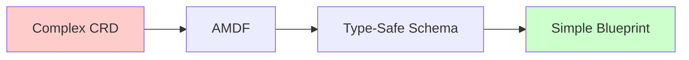
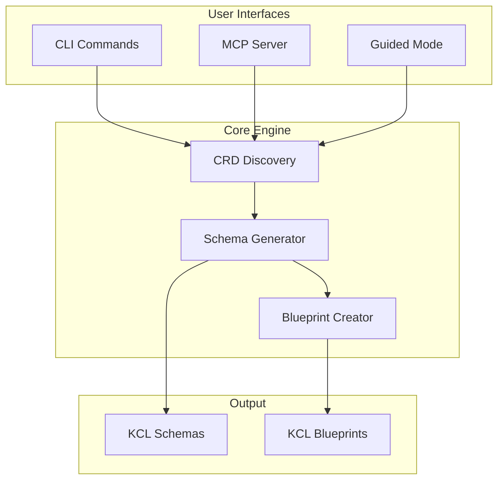

# AMDF - Agnostic Multi-cloud Delivery Framework


**Transform any Kubernetes CRD into type-safe KCL schemas and developer-friendly blueprints**

[Quick Start](getting-started/quick-start.md){ .md-button .md-button--primary }
[Examples](examples/basic.md){ .md-button }

## The Problem

Working with Kubernetes Custom Resource Definitions is complex:

- 🔴 **Complex YAML** - CRDs have hundreds of fields and nested structures
- 🔴 **No validation** - Errors discovered only at deployment time
- 🔴 **Inconsistent patterns** - Each provider uses different conventions
- 🔴 **Steep learning curve** - Developers need deep CRD knowledge

## The AMDF Solution

AMDF automatically transforms complex CRDs into simple, validated interfaces:



### What You Get

| Before AMDF | After AMDF |
|-------------|------------|
| 500+ line CRD specs | 10-line blueprints |
| Runtime validation errors | Compile-time type checking |
| Provider-specific patterns | Unified interface |
| Manual documentation | Auto-generated examples |

## Core Capabilities

### 🔍 **Universal Discovery**
Automatically finds and catalogs all CRDs in your cluster, regardless of provider or complexity.

### 🏗️ **Smart Generation**
Creates two complementary outputs:

- **Detailed Schemas** - Complete type-safe models for advanced users
- **Simple Blueprints** - Curated interfaces exposing only essential parameters

### 🤖 **AI-Enhanced Experience**
Built-in AI assistant explains generated code and provides usage examples via Ollama integration.

### 🔌 **Multiple Interfaces**

- **CLI Tool** - Direct command-line usage
- **MCP Server** - Integration with AI development tools
- **Guided Mode** - Interactive wizard for beginners

## Architecture

AMDF follows a clean, modular design:



## Real-World Impact

### Platform Teams
Transform hundreds of CRDs into consistent, validated schemas that development teams can actually use.

### DevOps Engineers
Eliminate configuration drift and deployment failures with compile-time validation.

### Application Developers
Focus on business logic instead of learning complex CRD specifications.

## Getting Started

### Installation
```bash
pip install -e .
```

### Basic Workflow
```bash
# Discover what's available
amdf list-crds --filter aws

# Generate schemas
amdf generate instances.ec2.aws.upbound.io

# Use the blueprint
import library.blueprints.Instance

server = Instance.InstanceBlueprint {
    _metadataName = "web-server"
    _instanceType = "t3.medium"
}
```

### Interactive Mode
```bash
# Guided experience with AI explanations
amdf guided --ai-model qwen3-coder:30b
```

## Ecosystem Integration

AMDF works seamlessly with your existing tools:

- **[KCL](https://kcl-lang.io)** - The configuration language that powers our schemas
- **[Any CRDS For Kubernetes](https://landscape.cncf.io/)** - Universal control plane for cloud resources
- **[Kubernetes](https://kubernetes.io)** - The platform we extend and enhance
- **[Ollama](https://ollama.ai)** - Local AI for intelligent code explanations
