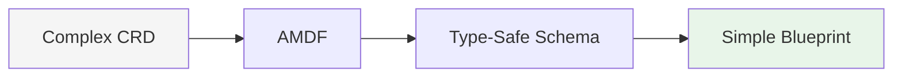
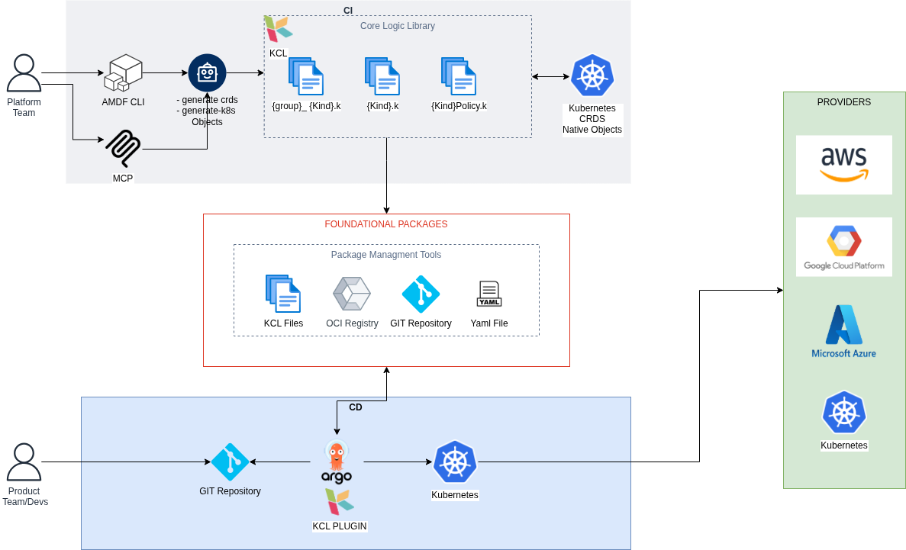
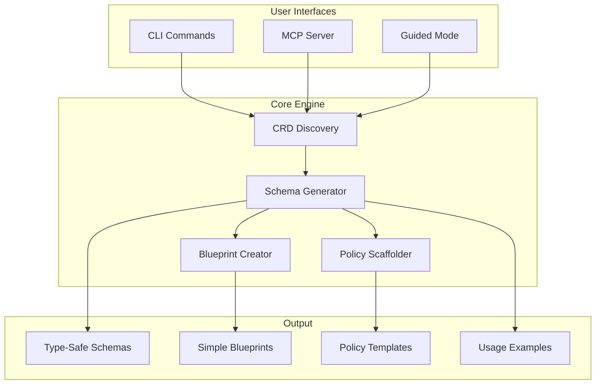

# AMDF - Agnostic Multi-cloud Delivery Framework


**Transform any Kubernetes CRD into type-safe schemas and developer-friendly blueprints using KCL**

[Quick Start](getting-started/quick-start.md){ .md-button .md-button--primary }
[Examples](examples/basic.md){ .md-button }

---

## Why AMDF?

### The Problem: CRD Complexity at Scale

Modern Kubernetes environments present significant challenges:

- **CRD Proliferation**: Production clusters typically run dozens of operators (Crossplane, Istio, ACK). Each CRD specification contains hundreds of fields with complex nesting and relationships.

- **Configuration Overhead**: YAML-based configuration is verbose and lacks type safety, leading to copy-paste patterns and maintenance burden.

- **Steep Learning Curve**: Teams need deep Kubernetes expertise to effectively use infrastructure resources, creating bottlenecks.

- **Delayed Feedback**: Configuration errors surface at deployment time rather than during development, slowing iteration cycles.

- **Pattern Fragmentation**: Without standardization, teams develop inconsistent approaches, making knowledge transfer difficult.

---

## The AMDF Solution

AMDF automatically transforms complex CRDs into simple, validated interfaces:



### Key Benefits

| Before AMDF | After AMDF |
|-------------|------------|
| Verbose YAML configurations | Concise, type-safe definitions |
| Runtime validation errors | Compile-time type checking |
| Manual templates per team | Centralized, versioned modules |
| Ad-hoc policy enforcement | Automated compliance checks |
| Platform team dependency | Self-service infrastructure |

---

## How Teams Use AMDF

### 🚀 For Platform Engineers

**Challenge**: Managing numerous CRDs while supporting development teams requires significant effort.

**AMDF Value**:
- **Generate once, use everywhere**: Create reusable blueprints from any CRD in seconds
- **Reduce cognitive load**: Developers use simple interfaces instead of complex specs
- **Package & distribute**: Share modules via OCI registries (public/private)
- **Version control**: Track changes and roll back when needed

**Outcome**: Platform team scales efficiently, enabling developer productivity.

### 🛡️ For DevOps & SREs

**Challenge**: Maintaining configuration consistency and preventing deployment failures across environments.

**AMDF Value**:
- **Shift-left validation**: Catch errors at compile-time, not in production
- **Policy templates**: Auto-generate validation rules from CRD schemas
- **Compliance automation**: Enforce organizational security and resource standards
- **Consistent patterns**: Eliminate configuration drift

**Outcome**: Improved reliability and faster deployment cycles.

### 💻 For Application Developers

**Challenge**: Provisioning infrastructure requires deep Kubernetes expertise.

**AMDF Value**:
- **Simple interfaces**: Use blueprints with only essential fields exposed
- **Type safety**: IDE autocomplete and validation as you type
- **Clear examples**: Auto-generated `main.k` files show exactly how to use resources
- **Self-service**: Provision infrastructure independently

**Outcome**: Focus on application development, not infrastructure complexity.

---

## Core Capabilities

### 🔍 Universal Discovery
- List all CRDs in your cluster with filtering
- Discover native Kubernetes resources (Pod, Service, Deployment, etc.)
- Support for any operator: Crossplane, Istio, ACK, KRO, custom CRDs

### 🏗️ Smart Generation

AMDF creates a complete toolkit for each resource:

1. **Complete Schema** (`library/models/`)
   - Full-fidelity, type-safe representation
   - All fields with documentation
   - For advanced use cases

2. **Simple Blueprint** (`library/blueprints/`)
   - Curated interface with essential fields
   - Sensible defaults
   - For day-to-day usage

3. **Policy Template** (`library/policies/`)
   - Auto-generated validation rules
   - Customizable compliance checks
   - Leverages KCL's native validation (we make it easier)

4. **Usage Example** (`library/main.k`)
   - Working code you can run immediately
   - Shows best practices
   - Includes policy application

### 🛡️ Validation Made Easy

While KCL provides powerful validation capabilities, AMDF makes them accessible:

- **Auto-scaffolded policies**: We generate policy templates from CRD schemas
- **Common checks included**: Security, resources, naming conventions
- **Easy customization**: Uncomment what you need, add your own rules
- **Compile-time feedback**: Errors in seconds, not minutes

```kcl
# AMDF generates this for you
schema DeploymentPolicyMixin:
    check:
        _replicas >= 2, "Minimum 2 replicas for HA"
        all container in _template.spec.containers {
            "latest" not in container.image
        }, "No 'latest' tags allowed"
```

### 🤖 AI-Native Experience

- **MCP Server**: Standardized interface for AI development tools
- **Guided Mode**: Interactive wizard with contextual assistance
- **Local AI Integration**: Privacy-focused explanations via Ollama

### 📦 Distribution & Reusability

- Package modules in OCI registries
- Share across teams and organizations
- Version control and dependency management
- GitOps-ready workflows

---

## Architecture

AMDF follows a clean, modular design:

### Complete Architecture



The diagram above shows the complete end-to-end flow:

- **Platform Team** uses AMDF CLI or MCP Server to generate KCL schemas from CRDs

- **Core Logic Library** produces type-safe schemas, blueprints, and policies

- **Foundational Packages** enable distribution via OCI Registry, Git, or YAML

- **Product Teams/Devs** consume packages through GitOps workflows (Argo + KCL Plugin)

- **Multi-cloud Providers** (AWS, GCP, Azure) receive validated configurations via Kubernetes

### Core Engine Detail



---

## Getting Started

### Installation
```bash
pip install amdf
```

### Basic Workflow
```bash
# Discover what's available
amdf list-crds --filter aws
amdf list-k8s --filter deployment

# Generate schemas from CRDs
amdf generate instances.ec2.aws.upbound.io

# Generate schemas from native Kubernetes objects
amdf generate-k8s Pod
amdf generate-k8s Service

# Use the blueprints
import library.blueprints.Instance
import library.blueprints.Service

# Crossplane resource
server = Instance.InstanceBlueprint {
    _metadataName = "web-server"
    _instanceType = "t3.medium"
}

# Native Kubernetes resource
service = Service.ServiceBlueprint {
    _metadataName = "nginx"
    _namespace = "demo"
    _labels = {app = "nginx"}
    _ports = [{name = "http", port = 80, protocol = "TCP", targetPort = 80}]
    _selector = {app = "nginx"}
    _type = "ClusterIP"
}
```

### Interactive Mode
```bash
# Guided experience with AI explanations
amdf guided --ai-model qwen3-coder:30b
```

---

## Ecosystem Integration

AMDF orchestrates a best-in-class stack to deliver infrastructure as code:

- **[KCL](https://kcl-lang.io)** (Configuration Engine)
  Provides the modeling language, validation logic, and schema generation capabilities.

- **[CNCF Ecosystem](https://landscape.cncf.io/)** (Target Resource Model)
  Compatible with **any Kubernetes CRD**, like Crossplane, ACK, KRO, Config Connector, and custom operators.

- **[Kubernetes](https://kubernetes.io)** (Control Plane)
  Serves as the universal API and reconciliation engine that AMDF extends.

- **[Ollama](https://ollama.ai)** (Local Intelligence)
  Powers the integrated AI assistant for offline, privacy-focused schema explanations and guidance.

- **[Model Context Protocol (MCP)](https://modelcontextprotocol.io)** (Agentic Interface)
  Exposes AMDF as a standardized server, allowing AI clients to directly interact with, query, and generate infrastructure.
