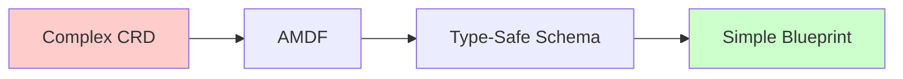
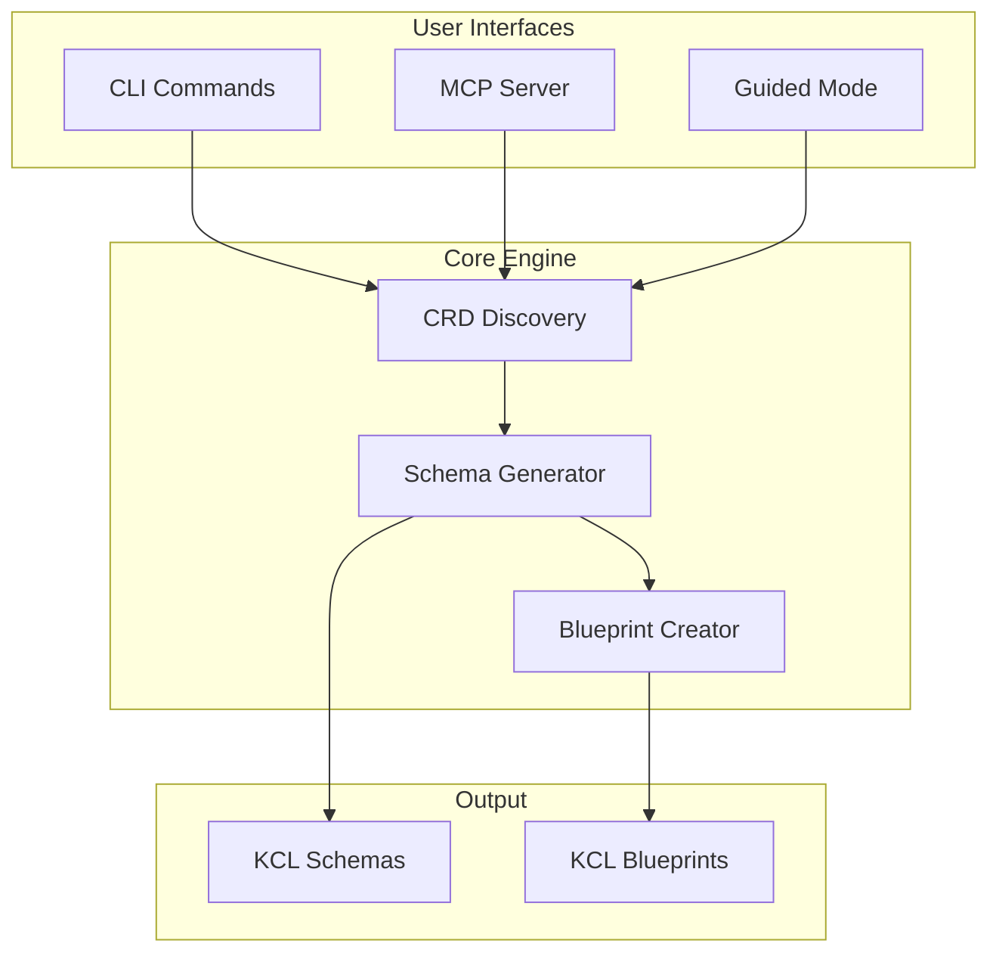

# AMDF - Agnostic Multi-cloud Delivery Framework


**Transform any Kubernetes CRD into type-safe KCL schemas and developer-friendly blueprints**

[Quick Start](getting-started/quick-start.md){ .md-button .md-button--primary }
[Examples](examples/basic.md){ .md-button }

## Why AMDF?

Direct interaction with Kubernetes Custom Resource Definitions (CRDs) presents critical challenges:

- **❌ Security & Compliance Risks** Without strict schemas, misconfigurations are easy to commit and hard to validate.

- **❌ Developer Velocity Bottleneck** Writing thousands of lines of YAML manually is slow, error-prone, and hard to reuse across teams.

- **❌ Inefficient Feedback Loops**
  Engineers waste valuable cycles waiting for CI/CD pipelines to fail, rather than catching configuration errors instantly in the IDE.


## The AMDF Solution

AMDF automatically transforms complex CRDs into simple, validated interfaces:



### What You Get

| Before AMDF | After AMDF |
|-------------|------------|
| Complex CRD Manifests | Streamlined Blueprints |
| Runtime validation errors | Compile-time type checking |
| Provider-specific patterns | Unified interface |
| Manual documentation | Auto-generated examples |

## Core Capabilities

### 🔍 **Universal Discovery**
Automatically finds and catalogs all CRDs in your cluster

### 🏗️ **Smart Generation**

- **The Library Model (Schema)** - Complete, type-safe representations of the raw CRD.

- **The Developer Interface (Blueprint)** - A concise, easy-to-read module that **exposes only essential configuration**.

### 🤖 **AI-Enhanced Experience**
Built-in AI assistant explains generated code and provides usage examples via Ollama integration.

### 🔌 **Multiple Interfaces**

- **CLI Tool** - Direct command-line usage
- **MCP Server** - Integration with AI development tools
- **Guided Mode** - Interactive wizard for beginners

## Architecture

AMDF follows a clean, modular design:



## Real-World Impact

### Platform Teams
Transform hundreds of CRDs into consistent, validated schemas that development teams can actually use.

### DevOps Engineers
Eliminate configuration drift and deployment failures with compile-time validation.

### Application Developers
Focus on business logic instead of learning complex CRD specifications.

## Getting Started

### Installation
```bash
pip install amdf
```

### Basic Workflow
```bash
# Discover what's available
amdf list-crds --filter aws

# Generate schemas
amdf generate instances.ec2.aws.upbound.io

# Use the blueprint
import library.blueprints.Instance

server = Instance.InstanceBlueprint {
    _metadataName = "web-server"
    _instanceType = "t3.medium"
}
```

### Interactive Mode
```bash
# Guided experience with AI explanations
amdf guided --ai-model qwen3-coder:30b
```

## Ecosystem Integration

AMDF orchestrates a best-in-class stack to deliver infrastructure as code:

- **[KCL](https://kcl-lang.io)** (Configuration Engine)
  Provides the modeling language, validation logic, and schema generation capabilities.

- **[CNCF Ecosystem](https://landscape.cncf.io/)** (Target Resource Model)
  Compatible with **any Kubernetes CRD**, like as Crossplane, ACK, , KRO, Config Connector, and custom operators.

- **[Kubernetes](https://kubernetes.io)** (Control Plane)
  Serves as the universal API and reconciliation engine that AMDF extends.

- **[Ollama](https://ollama.ai)** (Local Intelligence)
  Powers the integrated AI assistant for offline, privacy-focused schema explanations and guidance.

- **[Model Context Protocol (MCP)](https://modelcontextprotocol.io)** (Agentic Interface)
  Exposes AMDF as a standardized server, allowing AI clients to directly interact with, query, and generate infrastructure.